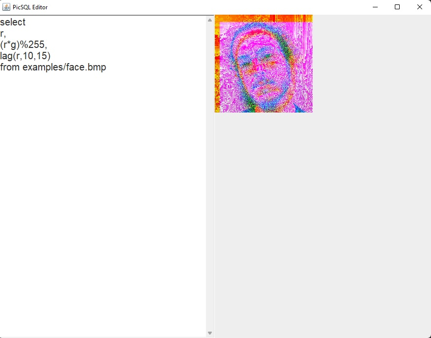

### (NEXT) Version 1.0.3

- Create GIF animation with syntax :

```sql
select r, g, (t * 10) % 255
from (./examples/face.bmp, 50)
```

Create a GIF by applying 50 times the query on the same picture, with increments "t" from 0 to 50.

Run query like that :

```bash
picsql.jar "select r, g, (t * 10) % 255from (./examples/face.bmp, 50)" "test.gif"
```

### Version 1.0.2

- Fix subqueries

### Version 1.0.1

- Load a grid of a same picture with syntax :
```sql
select r, g, b
from (./examples/face.bmp, 5, 5)
```
Picture face.bmp is loaded 25 times in a grid of 5 x 5.

- Launch a simple GUI by add "--gui" flag:

```bash
picsql.jar --gui
```



- Fixes and Gradle updates.

### Version 1.0.0

- Access to r,g,b channels and x,y position.
- FROM can load picture, region of picture, colored rectangle or data from subquery.
- Math operators : *, /, +, -, %.
- Math functions: rand, pi, cos, sin, tan.
- Where clause with boolean operators : and / or.
- Lag and lead to get relative pixels from a position.
