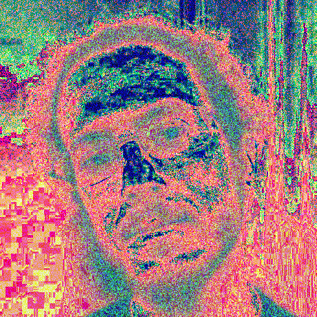

## PicSQL

A Java library to query pictures with SQL-like language.

### Examples

Original picture :


Switch r,g,b channels:

```sql
 select
   b, g, r
 from ./test.bmp
```


Modify values with maths :

```sql
 select
     (r*g)%255,
     (g+b)%255, 
     b
 from ./test.bmp
```


Use x,y values :

```sql
select
    (x*y)%255,
    (r+x+y)%255,
    x
from ./test.bmp
```


Add rand() function to generate values between 0 and 1:

```sql
select
    (r+rand()*20)%255,
    (r*g+rand()*20)%255,
    rand()*255
from ./test.bmp
```



Blend pictures with alias on picture names :
```sql
select
    t1.r,
    (t1.g + t2.b)%255,
    t2.b
from ./test.bmp t1, ./test2.bmp t2
```

Image test2 : 


Blended picture :

