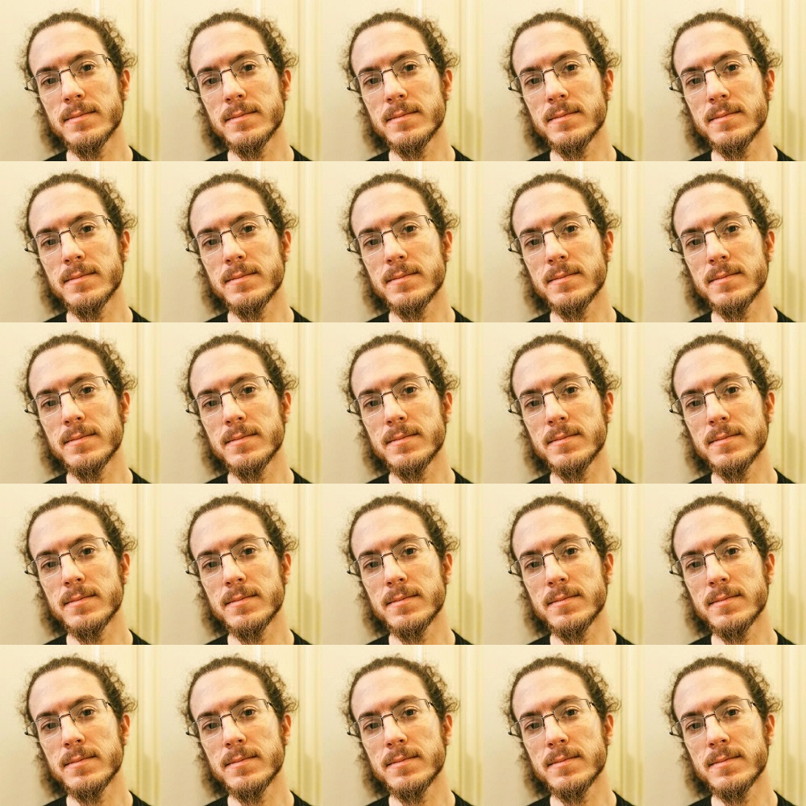
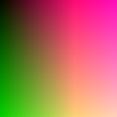
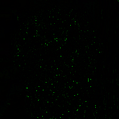

## PicSQL

A Java library to query pictures with SQL-like language.

Features :

- Select and manipulate pixels of pictures in your disk with SQL-like dialect (only BMP at this time).
- Access to each color channel r,b,g and pixel position : x,y, rank().
- Can query any number of pictures in the FROM clause, load only a region or subquery or build a colored rectangle.
- Math operators : *, /, +, -, %.
- Math functions: rand, pi, cos, sin, tan.
- Where clause with boolean operators : and / or.
- Lag and lead to get relative pixels from a position.

### Launch with command line

```bash
picsql.jar "select r,g,b from ./test.bmp" "./output.bmp"
```

Can also be used like a library by including JAR (doc coming soon).

### Examples

**Test pictures :**

face.bmp


face2.bmp


<hr>

Select r,g,b channels:

```sql
select r, g, b
from./examples/face.bmp -- same image that original, we rebuild it.
```


<hr>

Select only region :

```sql
select r, g, b
from (. / examples / face . bmp, 10, 50, 120, 120) -- (x,y,width,height) of a region
```


<hr>

Create a colored rectangle :

```sql
select r, g, b
from (100, 100, 255, 0, 0) -- (width,height, r, g, b)
```



<hr>

Blend colors :

```sql
select g, b, r
from./examples/face.bmp -- put green in red, blue in green and red in blue.
```


<hr>

Play with x and y :

```sql
select (r * y)%255, x,  b
from./examples/face.bmp
```


<hr>

Only x and y :

```sql
select x * 2, y + 10, x - 10
from./examples/face.bmp -- same size than face.bmp
```



<hr>

Where condition :

```sql
select r, g, b
from./examples/face.bmp
where r > 120
```


<hr>

Where condition on two values :

```sql
select r, g, b
from./examples/face.bmp
where r > 20 and g < 200
```


<hr>

Some maths :

```sql
select (r * sin(x))%255, 
       (g*tan(y))%255, 
       (cos(r))%255
from./examples/face.bmp
```


<hr>

Lag and lead :

```sql
select lag(r, 10, 10), --lag select a red value at x-10, y-10
       lead(g, 5, 5),  --lead green value at +5,+5.
       g
from./examples/face.bmp, 
```


<hr>

Complex Lag and lead :

```sql
select lag(r, sin(x), (r * g)%10),
       lag(r, y%10, rank()%10),
       lead(b, 10, 15)
from./examples/face.bmp
```


<hr>

Nested Lag and lead :

```sql
-- Lag, lead or other functions can be nested
select lag(r, lag(g, 5, 5)%5, 5),
       lag(g, 10, lag(r, 5, 5)%5),
       lag(r,
           lag(g, 5, 15)%20,
           lead(g, 15, 5)%10
           )
from./examples/face.bmp
```


<hr>

Picture blending :

```sql
select f.r, -- reference the red of the first picture
       f.g, -- reference the green of the first picture
       f2.b -- reference to the blue of the second picture
from
    ./examples/face.bmp f, -- alias is necessary with more than one picture
    ./examples/face2.bmp f2
```



<hr>

Picture blending madness:

```sql
select (f.r + f2.b)%255, 
       lead(f.r, f2.b%10, 10), 
       f.g
from./examples/face.bmp f, ./examples/face2.bmp f2
```


<hr>

Subqueries:

```sql
select sub1.r,
       sub2.g,
       (sub2.b + sub1.r)%255
from
    (select r from./examples/face.bmp where r > 60) sub1,
    (select b, g, lag(r, 5, 5) from./examples/face2.bmp) sub2
```

