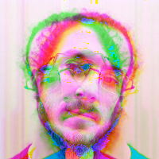
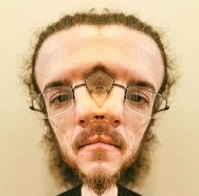
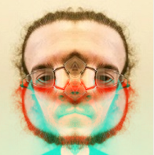
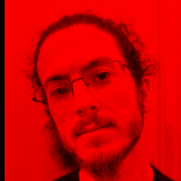

## PicSQL

A Java library to query pictures with SQL-like language.

Features :

- Select and manipulate pixels of pictures in your disk with SQL-like dialect (only BMP at this time).
- Access to each color channel r,b,g and pixel position : x,y, rank().
- Can query any number of pictures in the FROM clause, load only a region or subquery or build a colored rectangle.
- Math operators : *, /, +, -, %.
- Math functions: rand, pi, cos, sin, tan.
- Where clause with boolean operators : and / or.
- Lag and lead to get relative pixels from a position.
- Simple editor with execution of query in real time.

### Launch with command line

```bash
java -jar picsql.jar "select r,g,b from ./test.bmp" "./output.bmp"
```

---

### Launch a GUI

```bash
java -jar picsql.jar --gui
```

---

### Last released version : 1.0.5

### [Changelogs](CHANGELOG.md)

---

### Examples

[Select RGB Channels](#select-rgb-channels)

[Select only region](#select-only-region)

[Select and create i * j grid](#select-and-create-i--j-grid)

[Create a colored rectangle](#create-a-colored-rectangle)

[Blend colors](#blend-colors)

[Play with x and y](#play-with-x-and-y)

[Only x and y](#only-x-and-y)

[Where condition](#where-condition)

[Where condition on two values](#where-condition-on-two-values)

[Maths functions](#maths-functions)

[Lag and Lead](#lag-and-lead)

[Complex lag and lead](#complex-lag-and-lead)

[Nested lag and lead](#nested-lag-and-lead)

[Picture blending](#picture-blending)

[Picture blending madness](#picture-blending-madness)

[Subqueries](#subqueries)

[Convolution Mask](#convolution-mask)

[Discretization function](#discretization-function)

[Flip a channel on x, y or xy axis](#flip-a-channel-on-x-y-or-xy-axis)

[Butter function](#butter-function)

[GIF animation](#gif-animation)

**Test pictures :**

face.bmp


face2.bmp


<hr>

### Select r,g,b channels

```sql
select r, g, b
from./examples/face.bmp -- same image that original, we rebuild it.
```


<hr>

### Select only region

```sql
select r, g, b
from (. / examples / face . bmp, 10, 50, 120, 120) -- (x,y,width,height) of a region
```


<hr>

### Select and create i * j grid

```sql
select r, g, b
from (./examples/face.bmp, 5, 5)
```


<hr>

### Create a colored rectangle

```sql
select r, g, b
from (100, 100, 255, 0, 0) -- (width,height, r, g, b)
```


<hr>

### Blend colors

```sql
select g, b, r
from./examples/face.bmp -- put green in red, blue in green and red in blue.
```


<hr>

### Play with x and y

```sql
select (r * y)%255, x,  b
from./examples/face.bmp
```


<hr>

### Only x and y

```sql
select x * 2, y + 10, x - 10
from./examples/face.bmp -- same size than face.bmp
```


<hr>

### Where condition

```sql
select r, g, b
from./examples/face.bmp
where r > 120
```


<hr>

### Where condition on two values

```sql
select r, g, b
from./examples/face.bmp
where r > 20 and g < 200
```


<hr>

### Maths functions

```sql
select (r * sin(x))%255, 
       (g*tan(y))%255, 
       (cos(r))%255
from./examples/face.bmp
```


<hr>

### Lag and lead

```sql
select lag(r, 10, 10), --lag select a red value at x-10, y-10
       lead(g, 5, 5),  --lead green value at +5,+5.
       g
from./examples/face.bmp, 
```


<hr>

### Complex Lag and lead

```sql
select lag(r, sin(x), (r * g)%10),
       lag(r, y%10, rank()%10),
       lead(b, 10, 15)
from./examples/face.bmp
```


<hr>

### Nested Lag and lead

```sql
-- Lag, lead or other functions can be nested
select lag(r, lag(g, 5, 5)%5, 5),
       lag(g, 10, lag(r, 5, 5)%5),
       lag(r,
           lag(g, 5, 15)%20,
           lead(g, 15, 5)%10
           )
from./examples/face.bmp
```


<hr>

### Picture blending

```sql
select f.r, -- reference the red of the first picture
       f.g, -- reference the green of the first picture
       f2.b -- reference to the blue of the second picture
from
    ./examples/face.bmp f, -- alias is necessary with more than one picture
    ./examples/face2.bmp f2
```


<hr>

### Picture blending madness

```sql
select (f.r + f2.b)%255, 
       lead(f.r, f2.b%10, 10), 
       f.g
from./examples/face.bmp f, ./examples/face2.bmp f2
```


<hr>

### Subqueries

```sql
select sub1.r,
       sub2.g,
       (sub2.b + sub1.r)%255
from
    (select r from./examples/face.bmp where r > 60) sub1,
    (select b, g, lag(r, 5, 5) from./examples/face2.bmp) sub2
```



<hr>

### Convolution Mask

A convolution mask is a 9 values array, that will be applied on each pixel of the picture. Each value in the array take
a different value of a channel relative to the pixel. The result is the sum of the values divided by nine.

So if x is the pixel, and x1, x2, x3, x4, x5, x6, x7, x8 are the pixels around x, the convolution mask is :

```text
x1 | x2 | x3
x4 | x  | x5
x6 | x7 | x8
```

So value of red channel x.r is : (x1.r + x2.r + x3.r + x4.r + x.r + x5.r + x6.r + x7.r + x8.r) / 9

```sql
select r,
[-r,-b,-g,b*2,r,r,r,g*2,b],
[b,-b,b*2,r*r,b,g,b,-g,g]
from ./examples/face.bmp
```


<hr>

### Discretization function

Take a value of a channel and return a value between 0 and 255, with a step of 255 / step.

```sql
select
    discr(r, 10),
    discr(r, 5),
    discr(g, 3)
from ./examples/face.bmp
```


<hr>

### Flip a channel on x, y or xy axis

 ```sql
select
flip(r, x),
flip(g, x),
flip(b, x)
from ./examples/face.bmp
```



Ugly example:

```sql
select
    flip(r, x),
    flip(g, xy),
    flip(b, xy)
from ./examples/face.bmp
```



### Butter function

Select r, g or b color channel of the real butter color !

```sql
select
    butter(r),
    g,
    butter(b)
from ./examples/face.bmp
```


Kalon vat !

### GIF animation

```sql
select lag(r, 5, t%20), (g*t)%255, (t * 10) % 255 
from (./examples/face.bmp, 50)
```

Create a GIF by applying 50 times the query on the same picture, with increments "t" from 0 to 50.

Run query like that :

```bash
java -jar picsql.jar "select lag(r, 5, t%20), (g*t)%255, (t * 10) % 255 from (./examples/face.bmp, 50)" "test.gif"
```

Result:


